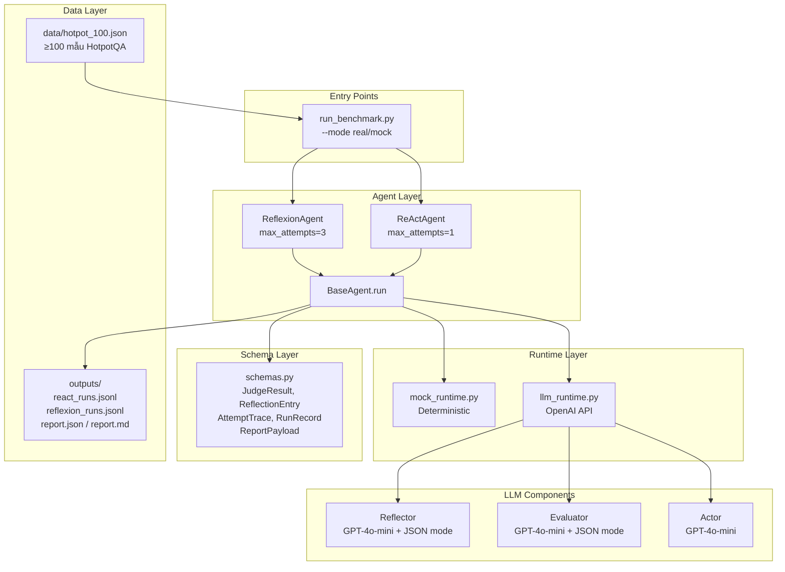
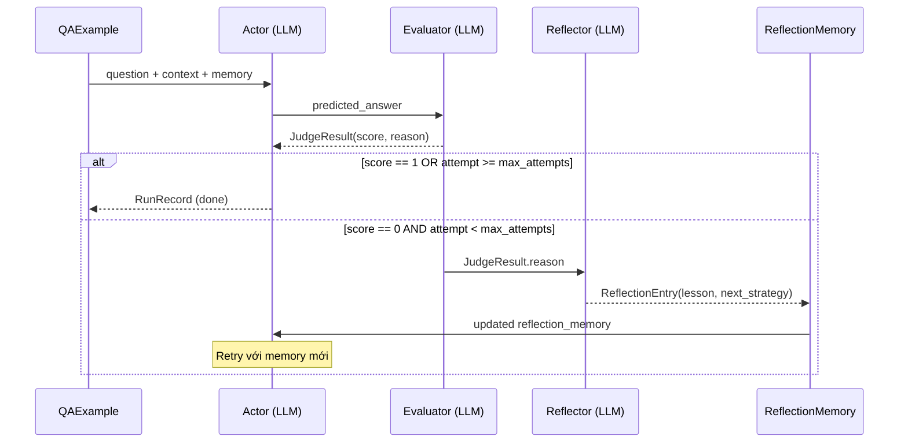
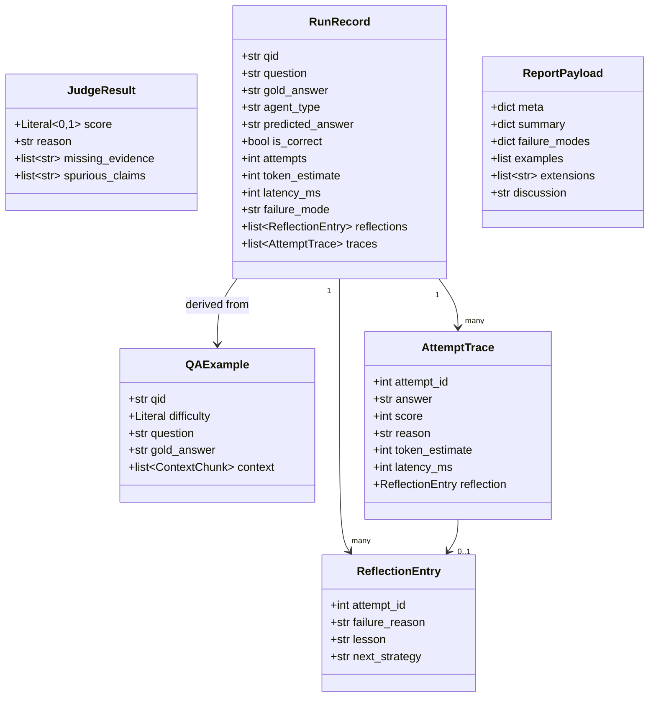
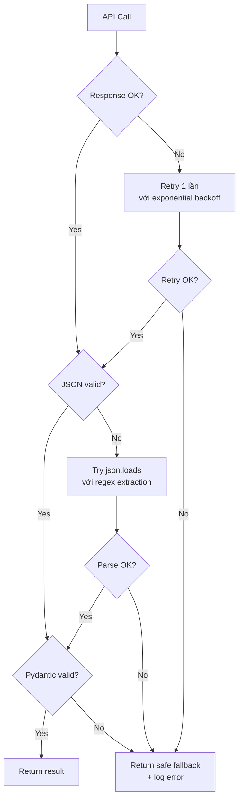

# Tài liệu Thiết kế — Lab 16: Reflexion Agent

## Tổng quan

Hệ thống **Reflexion Agent Lab** là một framework thực nghiệm so sánh hai chiến lược agent AI trên bộ dữ liệu hỏi đáp đa bước (multi-hop QA) HotpotQA:

- **ReAct Agent**: Thực hiện một lần thử duy nhất, không có cơ chế tự sửa lỗi.
- **Reflexion Agent**: Thực hiện tối đa `max_attempts` lần, sau mỗi lần thất bại sẽ phân tích lỗi và điều chỉnh chiến thuật.

Mục tiêu là thay thế toàn bộ mock runtime bằng LLM thật (OpenAI GPT-4o-mini), đo token thực tế, đo latency, và xuất báo cáo benchmark đúng định dạng để `autograde.py` chấm điểm.

### Mục tiêu kỹ thuật

- Gọi OpenAI API với `response_format={"type": "json_object"}` cho Evaluator và Reflector
- Đo token thực tế từ `response.usage.total_tokens`
- Đo latency bằng `time.time()` trước/sau mỗi API call
- Load API key từ `.env` qua `python-dotenv`
- Chạy benchmark ≥100 mẫu HotpotQA
- Xuất `report.json` và `report.md` đúng schema

---

## Kiến trúc

### Sơ đồ tổng thể



### Vòng lặp Reflexion



---

## Các thành phần và Interface

### 1. `schemas.py` — Data Models

Tất cả schema dùng Pydantic v2 với validation chặt chẽ.

```python
class JudgeResult(BaseModel):
    score: Literal[0, 1]          # Bắt buộc: 0 hoặc 1
    reason: str                    # Bắt buộc: lý do chấm điểm
    missing_evidence: list[str] = []   # Optional: bằng chứng còn thiếu
    spurious_claims: list[str] = []    # Optional: thông tin sai

class ReflectionEntry(BaseModel):
    attempt_id: int                # Lần thử tương ứng
    failure_reason: str            # Nguyên nhân thất bại
    lesson: str                    # Bài học rút ra
    next_strategy: str             # Chiến thuật cho lần tiếp theo
```

**Quyết định thiết kế**: Dùng `Literal[0, 1]` thay vì `int` với validator để Pydantic tự động reject giá trị ngoài tập {0, 1} mà không cần custom validator.

### 2. `prompts.py` — System Prompts

Ba prompt độc lập, viết bằng tiếng Anh:

| Prompt | Mục đích | Output format |
|--------|----------|---------------|
| `ACTOR_SYSTEM` | Hướng dẫn Actor đọc context, dùng reflection memory | Plain text (câu trả lời ngắn) |
| `EVALUATOR_SYSTEM` | Chấm điểm 0/1, so sánh sau normalize | JSON: `{"score": 0/1, "reason": "..."}` |
| `REFLECTOR_SYSTEM` | Phân tích lỗi, đề xuất chiến thuật | JSON: `{"attempt_id": N, "failure_reason": "...", "lesson": "...", "next_strategy": "..."}` |

### 3. `llm_runtime.py` — LLM Runtime (module mới)

Thay thế hoàn toàn `mock_runtime.py` khi chạy ở `mode="real"`.

```python
# Interface công khai
def actor_answer(
    example: QAExample,
    attempt_id: int,
    agent_type: str,
    reflection_memory: list[str]
) -> tuple[str, int, float]:
    """Trả về (answer, token_count, latency_ms)"""

def evaluator(
    example: QAExample,
    answer: str
) -> tuple[JudgeResult, int, float]:
    """Trả về (JudgeResult, token_count, latency_ms)"""

def reflector(
    example: QAExample,
    attempt_id: int,
    judge: JudgeResult
) -> tuple[ReflectionEntry, int, float]:
    """Trả về (ReflectionEntry, token_count, latency_ms)"""
```

**Lưu ý**: Mỗi hàm trả về tuple `(result, token_count, latency_ms)` để `agents.py` có thể ghi vào `AttemptTrace` mà không cần tính toán lại.

### 4. `agents.py` — Agent Logic

`BaseAgent.run()` điều phối toàn bộ vòng lặp:

```python
class BaseAgent:
    def run(self, example: QAExample) -> RunRecord:
        reflection_memory: list[str] = []
        reflections: list[ReflectionEntry] = []
        traces: list[AttemptTrace] = []

        for attempt_id in range(1, self.max_attempts + 1):
            answer, tokens, latency = actor_answer(...)
            judge, e_tokens, e_latency = evaluator(...)

            trace = AttemptTrace(
                attempt_id=attempt_id,
                answer=answer,
                score=judge.score,
                reason=judge.reason,
                token_estimate=tokens + e_tokens,
                latency_ms=latency + e_latency
            )
            traces.append(trace)

            if judge.score == 1:
                break  # Dừng ngay khi đúng

            if self.agent_type == "reflexion" and attempt_id < self.max_attempts:
                entry, r_tokens, r_latency = reflector(...)
                reflection_memory.append(entry.next_strategy)
                reflections.append(entry)
                # Cộng token/latency của reflector vào trace cuối
                traces[-1].token_estimate += r_tokens
                traces[-1].latency_ms += r_latency
```

### 5. `run_benchmark.py` — Entry Point

Thêm flag `--mode real/mock` và error handling:

```python
@app.command()
def main(
    dataset: str = "data/hotpot_100.json",
    out_dir: str = "outputs/sample_run",
    reflexion_attempts: int = 3,
    mode: str = "mock"   # NEW: "real" hoặc "mock"
) -> None:
```

Khi `mode="real"`, import từ `llm_runtime`; khi `mode="mock"`, import từ `mock_runtime`.

---

## Data Models

### Sơ đồ quan hệ



### Token Aggregation

```
RunRecord.token_estimate = Σ AttemptTrace.token_estimate
AttemptTrace.token_estimate = actor_tokens + evaluator_tokens [+ reflector_tokens nếu có]
```

### Failure Mode Classification

| Failure Mode | Mô tả |
|---|---|
| `none` | Trả lời đúng |
| `entity_drift` | Nhầm entity ở hop thứ hai |
| `incomplete_multi_hop` | Dừng sau hop đầu, chưa hoàn thành |
| `wrong_final_answer` | Sai câu trả lời cuối |
| `looping` | Lặp lại cùng một lỗi qua nhiều lần thử |
| `reflection_overfit` | Reflection memory quá dài gây nhiễu |

---

## Correctness Properties

*A property is a characteristic or behavior that should hold true across all valid executions of a system — essentially, a formal statement about what the system should do. Properties serve as the bridge between human-readable specifications and machine-verifiable correctness guarantees.*

### Property 1: Score validation

*For any* integer value passed as `score` to `JudgeResult`, only values in `{0, 1}` shall be accepted; all other values shall raise a `ValidationError`.

**Validates: Requirements 1.1, 1.6**

---

### Property 2: ReflectionEntry completeness

*For any* `ReflectionEntry` instance, all four fields (`attempt_id`, `failure_reason`, `lesson`, `next_strategy`) shall be non-empty — `attempt_id` must be a positive integer and the string fields must be non-empty strings.

**Validates: Requirements 2.1, 2.5**

---

### Property 3: Evaluator output is always a valid JudgeResult

*For any* `(QAExample, answer)` pair passed to `evaluator()`, the function shall return a `JudgeResult` that passes Pydantic validation — even when the LLM returns malformed JSON, a safe fallback `JudgeResult(score=0, reason="parse error")` shall be returned instead of raising an exception.

**Validates: Requirements 4.2, 6.2, 6.5**

---

### Property 4: Reflector output is always a valid ReflectionEntry

*For any* `(QAExample, attempt_id, JudgeResult)` triple passed to `reflector()`, the function shall return a `ReflectionEntry` that passes Pydantic validation — even when the LLM returns malformed JSON, a safe fallback shall be returned.

**Validates: Requirements 5.2, 6.3, 6.5**

---

### Property 5: Reflexion memory propagation

*For any* sequence of failed attempts in `ReflexionAgent`, the `next_strategy` from each `ReflectionEntry` shall appear in the `reflection_memory` list passed to the Actor on the subsequent attempt.

**Validates: Requirements 7.1, 7.2**

---

### Property 6: Early stopping on success

*For any* `QAExample` where the Actor returns the correct answer on attempt `k` (1 ≤ k ≤ max_attempts), the `RunRecord` shall contain exactly `k` traces and `reflector()` shall not be called after attempt `k`.

**Validates: Requirements 7.4**

---

### Property 7: ReAct agent single attempt invariant

*For any* `QAExample` passed to `ReActAgent`, the resulting `RunRecord` shall always contain exactly 1 `AttemptTrace`, regardless of whether the answer is correct.

**Validates: Requirements 7.5**

---

### Property 8: Token estimate aggregation invariant

*For any* `RunRecord`, `token_estimate` shall equal the sum of `token_estimate` across all `AttemptTrace` objects in `traces`.

**Validates: Requirements 7.6, 10.2**

---

### Property 9: Token count from API usage

*For any* successful OpenAI API call that returns a `usage` object, the `token_count` recorded in `AttemptTrace` shall equal `response.usage.total_tokens`.

**Validates: Requirements 6.6, 10.1**

---

### Property 10: Error resilience in benchmark

*For any* dataset where a subset of samples cause LLM API errors, `run_benchmark.py` shall complete processing all remaining samples and the final `RunRecord` list shall contain records for all non-errored samples.

**Validates: Requirements 8.5**

---

### Property 11: Report token sum consistency

*For any* set of `RunRecord` objects passed to `build_report()`, the `avg_token_estimate` in the summary shall equal the arithmetic mean of `token_estimate` across all records of that agent type.

**Validates: Requirements 9.3**

---

## Xử lý lỗi

### Chiến lược xử lý lỗi theo tầng



### Fallback values

| Hàm | Fallback khi lỗi |
|-----|-----------------|
| `actor_answer()` | `("", 0, 0.0)` — chuỗi rỗng, 0 token, 0ms |
| `evaluator()` | `JudgeResult(score=0, reason="evaluation error")` |
| `reflector()` | `ReflectionEntry(attempt_id=N, failure_reason="reflection error", lesson="", next_strategy="")` |

### JSON Extraction Fallback

Khi LLM trả về JSON lồng trong markdown code block hoặc có text thừa:

```python
import re

def extract_json(text: str) -> dict:
    # Thử parse trực tiếp
    try:
        return json.loads(text)
    except json.JSONDecodeError:
        pass
    # Thử extract từ code block
    match = re.search(r"```(?:json)?\s*(\{.*?\})\s*```", text, re.DOTALL)
    if match:
        return json.loads(match.group(1))
    # Thử tìm JSON object đầu tiên
    match = re.search(r"\{.*\}", text, re.DOTALL)
    if match:
        return json.loads(match.group(0))
    raise ValueError(f"No valid JSON found in: {text[:200]}")
```

### Error Logging trong Benchmark

```python
for i, example in enumerate(examples):
    try:
        record = agent.run(example)
        records.append(record)
    except Exception as e:
        logger.error(f"[{i+1}/{len(examples)}] qid={example.qid} error: {e}")
        continue  # Tiếp tục với sample tiếp theo
```

---

## Chiến lược Testing

### Dual Testing Approach

Hệ thống dùng cả unit test và property-based test:

- **Unit tests**: Kiểm tra các ví dụ cụ thể, edge cases, error conditions
- **Property tests**: Kiểm tra các invariant phổ quát trên nhiều input ngẫu nhiên

### Property-Based Testing

Dùng thư viện **`hypothesis`** (Python) với cấu hình tối thiểu 100 iterations mỗi property.

```python
from hypothesis import given, settings
from hypothesis import strategies as st

@given(score=st.integers().filter(lambda x: x not in {0, 1}))
@settings(max_examples=100)
def test_judge_result_rejects_invalid_score(score):
    """Feature: reflexion-agent-lab, Property 1: Score validation"""
    with pytest.raises(ValidationError):
        JudgeResult(score=score, reason="test")
```

### Test Coverage Map

| Property | Test file | Strategy |
|----------|-----------|----------|
| P1: Score validation | `tests/test_schemas.py` | `st.integers()` |
| P2: ReflectionEntry completeness | `tests/test_schemas.py` | `st.builds(ReflectionEntry, ...)` |
| P3: Evaluator output validity | `tests/test_llm_runtime.py` | Mock OpenAI + `st.text()` |
| P4: Reflector output validity | `tests/test_llm_runtime.py` | Mock OpenAI + `st.builds(JudgeResult, ...)` |
| P5: Memory propagation | `tests/test_agents.py` | Mock runtime + `st.lists(st.text())` |
| P6: Early stopping | `tests/test_agents.py` | Mock evaluator với score=1 tại attempt k |
| P7: ReAct single attempt | `tests/test_agents.py` | `st.builds(QAExample, ...)` |
| P8: Token aggregation | `tests/test_agents.py` | `st.lists(st.integers(min_value=0))` |
| P9: Token from API usage | `tests/test_llm_runtime.py` | Mock response với usage field |
| P10: Error resilience | `tests/test_benchmark.py` | Inject errors vào subset samples |
| P11: Report token sum | `tests/test_reporting.py` | `st.lists(st.builds(RunRecord, ...))` |

### Unit Tests (Example-based)

```python
# tests/test_schemas.py
def test_judge_result_defaults():
    """1.3, 1.4: missing_evidence và spurious_claims default là []"""
    j = JudgeResult(score=1, reason="correct")
    assert j.missing_evidence == []
    assert j.spurious_claims == []

def test_reflection_entry_all_fields():
    """2.2-2.4: Tất cả fields tồn tại"""
    e = ReflectionEntry(attempt_id=1, failure_reason="wrong", lesson="check hop 2", next_strategy="verify entity")
    assert e.attempt_id == 1
    assert isinstance(e.failure_reason, str)
    assert isinstance(e.lesson, str)
    assert isinstance(e.next_strategy, str)
```

### Integration Tests

```python
# tests/test_integration.py
def test_benchmark_produces_report(tmp_path):
    """8.1, 8.4: Benchmark chạy cả hai agent và tạo file output"""
    # Dùng mock mode với mini dataset
    ...

def test_report_has_100_records():
    """8.3: Dataset phải có ≥100 mẫu"""
    examples = load_dataset("data/hotpot_100.json")
    assert len(examples) >= 100
```

### Smoke Tests

```python
# tests/test_smoke.py
def test_openai_api_key_configured():
    """6.4: API key được load từ .env"""
    from dotenv import load_dotenv
    load_dotenv()
    assert os.getenv("OPENAI_API_KEY") is not None

def test_prompts_are_in_english():
    """3.4, 5.4: Prompts viết bằng tiếng Anh"""
    assert "you" in ACTOR_SYSTEM.lower() or "your" in ACTOR_SYSTEM.lower()
```

### Cấu hình Hypothesis

```python
# conftest.py hoặc settings.py
from hypothesis import settings, HealthCheck

settings.register_profile("ci", max_examples=100, suppress_health_check=[HealthCheck.too_slow])
settings.register_profile("dev", max_examples=20)
settings.load_profile("ci")
```

---

## Dataset HotpotQA

File `data/hotpot_mini.json` hiện chỉ có 8 mẫu. Cần tải thêm để đạt ≥100 mẫu.

### Cách tải dataset

```python
# scripts/download_hotpot.py
import json
import urllib.request

URL = "http://curtis.ml.cmu.edu/datasets/hotpot/hotpot_dev_distractor_v1.json"

def download_and_convert(n=150):
    """Tải và convert N mẫu HotpotQA sang format QAExample"""
    # Tải từ HuggingFace datasets (không cần download file lớn)
    from datasets import load_dataset
    ds = load_dataset("hotpot_qa", "distractor", split="validation")
    
    samples = []
    for i, item in enumerate(ds):
        if i >= n:
            break
        context_chunks = [
            {"title": title, "text": " ".join(sents)}
            for title, sents in zip(item["context"]["title"], item["context"]["sentences"])
        ]
        samples.append({
            "qid": f"hpqa_{i:04d}",
            "difficulty": "medium",
            "question": item["question"],
            "gold_answer": item["answer"],
            "context": context_chunks[:4]  # Giới hạn 4 chunks để tiết kiệm token
        })
    
    with open("data/hotpot_100.json", "w", encoding="utf-8") as f:
        json.dump(samples, f, indent=2, ensure_ascii=False)
    print(f"Saved {len(samples)} samples to data/hotpot_100.json")
```

### Cấu trúc file dataset

```json
[
  {
    "qid": "hpqa_0000",
    "difficulty": "medium",
    "question": "...",
    "gold_answer": "...",
    "context": [
      {"title": "...", "text": "..."},
      {"title": "...", "text": "..."}
    ]
  }
]
```

---

## Bonus Features

### Structured Evaluator (Yêu cầu 11)

Dùng OpenAI structured outputs thay vì parse JSON thủ công:

```python
from pydantic import BaseModel

def structured_evaluator(example: QAExample, answer: str) -> tuple[JudgeResult, int, float]:
    response = client.beta.chat.completions.parse(
        model=MODEL,
        messages=[...],
        response_format=JudgeResult,  # Pydantic model trực tiếp
    )
    result = response.choices[0].message.parsed
    return result, response.usage.total_tokens, latency_ms
```

Khi kích hoạt, thêm `"structured_evaluator"` vào `ReportPayload.extensions`.

### Reflection Memory nâng cao (Yêu cầu 12)

Cross-question memory lưu lessons từ các câu hỏi trước:

```python
class GlobalReflectionMemory:
    def __init__(self, max_lessons: int = 10):
        self._lessons: list[str] = []
        self.max_lessons = max_lessons

    def add(self, entry: ReflectionEntry) -> None:
        self._lessons.append(entry.lesson)
        if len(self._lessons) > self.max_lessons:
            self._lessons = self._lessons[-self.max_lessons:]  # Keep recent

    def get_relevant(self, question: str, k: int = 3) -> list[str]:
        """Trả về k lessons gần nhất (có thể mở rộng với semantic search)"""
        return self._lessons[-k:]
```

Khi kích hoạt, thêm `"reflection_memory"` vào `ReportPayload.extensions`.
